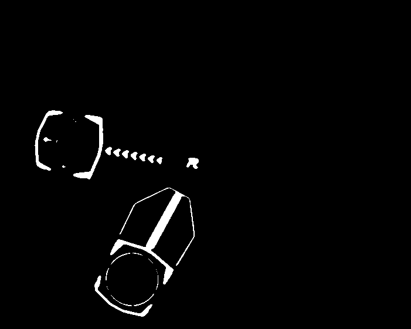

# 2023年笃行战队视觉组代码文档

# 等待修复

1. 速度函数收敛过慢
2. 坐标系转换有问题
3. 能量机关策略更新，加入支持神经网络的框架
4. 能量机关预测更新，以及部分的鲁棒性同步
5. 

# 简介

本文档主要介绍代码结构、代码流程、代码内容、算法原理、调参细节与其他内容。

# 环境依赖

1. MVS，可以前往[HIKROBOT官网](https://www.hikrobotics.com/cn/machinevision/service/download?module=0)找到Linux版本的MVS进行下载，之后解压压缩包，运行压缩包中的setup.sh即可。
2. glog，`sudo apt-get install libgoogle-glog-dev`。
3. Eigen3，`sudo apt-get install libeigen3-dev`。
4. ceres，通过`sudo apt-get install`确保已经下载依赖`libgoogle-glog-dev`、`libgflags-dev`、`libatlas-base-dev`、`libeigen3-dev`、`libsuitesparse-dev`，之后前往github中[ceres主页](https://github.com/ceres-solver/ceres-solver/tags)下载ceres1.1.4，使用cmake编译的方式安装。
5. openvino，下载[官方密钥](https://apt.repos.intel.com/openvino/2021/GPG-PUB-KEY-INTEL-OPENVINO-2021)，之后依次输入以下指令`sudo apt-key add <PATH_TO_DOWNLOADED_GPG_KEY>`，`echo "deb https://apt.repos.intel.com/openvino/2021 all main" | sudo tee /etc/apt/sources.list.d/intel-openvino-2021.list`，`sudo apt update`、`sudo apt install intel-openvino-runtime-ubuntu20-2021.4.752`，其中可能在echo这一步骤出错，导致update无法进行，则删除list文件之后使用`gedit`或者`vim`指令手动创建，然后输入echo的内容。
6. opencv，使用openvino自带的opencv。为了播放视频，需要安装依赖：`sudo apt-get install gstreamer1.0-libav`

# 代码结构

本代码当前的代码结构如下：
.
├── armor
│   ├── CMakeLists.txt
│   ├── include
│   │   ├── AimAuto.hpp
│   │   └── inference.hpp
│   └── src
│       ├── AimAuto.cpp
│       └── inference.cpp
├── build
├── camera
│   ├── CMakeLists.txt
│   ├── include
│   │   └── camera.hpp
│   └── src
│       └── camera.cpp
├── CMakeLists.txt
├── config
│   ├── WMConfigBlue.yaml
│   └── WMConfigRed.yaml
├── log
├── main.cpp
├── model
├── params
│   ├── CMakeLists.txt
│   ├── include
│   │   ├── general.hpp
│   │   ├── globalParam.hpp
│   │   ├── globalParamInit.hpp
│   │   ├── globalText.hpp
│   │   ├── monitor.hpp
│   │   └── UIManager.hpp
│   └── src
│       ├── general.cpp
│       ├── globalParamInit.cpp
│       ├── monitor.cpp
│       └── UIManager.cpp
├── readme.md
├── readme_src
├── restart.sh
├── serialPort
│   ├── CMakeLists.txt
│   ├── include
│   │   └── SerialPort.hpp
│   └── src
│       └── SerialPort.cpp
├── setup.sh
└── windmill
    ├── CMakeLists.txt
    ├── include
    │   ├── WMFunction.hpp
    │   ├── WMIdentify.hpp
    │   └── WMPredict.hpp
    └── src
        ├── WMFunction.cpp
        ├── WMIdentify.cpp
        └── WMPredict.cpp

本代码框架使用嵌套的CMakeLists，即将整体程序分为多个功能包，每个功能包含有include和src文件夹，各自通过CMakeLists进行管理。

## armor

本文件夹为自瞄功能包，其可以通过输入的图片，识别其中的装甲板并且返回装甲板中心在相机坐标系下的三维坐标。

## camera

本文件夹为相机取流功能包，其可以通过句柄打开海康MVS相机，并且可以通过MVS提供的相关API进行取流

## CMakeLists.txt

CMakeLists，用于编译代码，进行相关配置，同时在其中可以修改宏定义

## config

本文件夹中储存yaml格式的配置文件

## log

本文件夹中储存程序运行时输出的日志

## main.cpp

主程序，运行时运行此代码

## model

本文件夹中储存代码中需要的推理使用的模型

## params

本文件夹为功能功能包，包含全局参数结构体、全局地址结构体、功能函数等

## readme.md

本文件，readme文档，介绍整体的代码

## readme_src

本文件夹为readme所需要的资源的文件夹，主要存放图片

## restart.sh

程序执行的脚本，保证程序能找到对应的串口并且连接，同时退出程序之后可以重启程序

## serialPort

本文件夹为串口通信功能包，其可以通过初始化串口，来对于串口信息进行读和写操作

## setup.sh

初始化文档，在放入新环境后执行一次，用于将当前用户加入dialout用户组

## windmill

本文件夹为能量机关(打符)功能包，其可以通过输入图片，识别其中的能量机关的状态，并且通过弹速等信息，返回一定时间后云台需要旋转至并且开火的角度变化量

# 代码流程

# 通信协议

通信协议为23位，分为电控发给视觉的信息、打符时视觉发给电控的信息、自瞄时视觉发给电控的信息

## 电控发给视觉的信息

| 信息含义  | 长度 | 数据类型 | 单位 |
| --------- | ---- | -------- | ---- |
| pitch角   | 4    | float    | 弧度 |
| yaw角     | 4    | float    | 弧度 |
| 弹速      | 4    | float    | m/s  |
| 状态位    | 1    | uint8_t  | /    |
| 当前时间  | 4    | uint32_t | ms   |
| 预测时间  | 4    | uint32_t | ms   |
| crc校验位 | 2    | uint16_t | /    |

其中预测时间留空，无意义。

## 打符时视觉发给电控的信息

| 信息含义    | 长度 | 数据类型 | 单位 |
| ----------- | ---- | -------- | ---- |
| 绝对pitch角 | 4    | float    | 弧度 |
| delta yaw角 | 4    | float    | 弧度 |
| 弹速        | 4    | float    | m/s  |
| 状态位      | 1    | uint8_t  | /    |
| 当前时间    | 4    | uint32_t | ms   |
| 预测时间    | 4    | uint32_t | ms   |
| crc校验位   | 2    | uint16_t | /    |

## 自瞄时视觉发给电控的信息

| 信息含义  | 长度 | 数据类型 | 单位 |
| --------- | ---- | -------- | ---- |
| x坐标     | 4    | float    | mm   |
| y坐标     | 4    | float    | mm   |
| z坐标     | 4    | float    | mm   |
| 状态位    | 1    | uint8_t  | /    |
| pitch角   | 4    | float    | 弧度 |
| yaw角     | 4    | float    | 弧度 |
| crc校验位 | 2    | uint16_t | /    |

## 状态位含义

| 数字 | /5   | %5   | 颜色(己方) | 状态     |
| ---- | ---- | ---- | ---------- | -------- |
| 0    | 0    | 0    | 红色       | 自瞄     |
| 1    | 0    | 1    | 红色       | 击打小符 |
| 2    | 0    | 2    | 红色       | /        |
| 3    | 0    | 3    | 红色       | 击打大符 |
| 4    | 0    | 4    | 红色       | /        |
| 5    | 1    | 0    | 蓝色       | 自瞄     |
| 6    | 1    | 1    | 蓝色       | 击打小符 |
| 7    | 1    | 2    | 蓝色       | /        |
| 8    | 1    | 3    | 蓝色       | 击打大符 |
| 9    | 1    | 4    | 蓝色       | /        |

# 代码内容

## 常见自定义数据类型

### GlobalParam

全局参数结构体，其中存放一切可能更改的参数。

### Translator

串口消息联合体，其联合内容包括一个长度为23的字符数组、一个自瞄时的结构体、一个打符时的结构体。

## armor

### AimAuto

#### AimAuto(GlobalParam **gp*)

构造函数会读取GlobalParam(以指针的方式)，并且初始化推理器(加载模型)。

#### ~AimAuto()

空，使用默认方式析构。

#### void AimAuto::AimAutoNew(cv::Mat &*src*, Translator &*ts*)

输入图片以及串口信息，执行完毕后在串口信息中覆盖信息，写入目标装甲板中心在相机坐标系下的x、y、z坐标。

1. 将图片以及ArmorObject数组输入推理器的detect方法中，运行结果为ArmorObject数组中被存放若干被识别到的装甲板，其中主要需要使用的信息是装甲板的四个角点。
2. 通过装甲板在像素坐标系下的中心点距离屏幕中心点的x坐标距离绝对值对ArmorObject数组进行排序，这是因为需要按照率先瞄准距离操作手准星最近的装甲板这一策略。
3. 判断装甲板的颜色与自身车辆的颜色是否不同，如果不同，对装甲板进行PnP解算，求解出装甲板中心点在相机坐标系下的三维坐标，并存入队列。
4. 将队列中第一个元素写入信息。

### inference

本代码暂时为沈航战队的代码，使用四点神经网络对于图片进行推理并且对输出进行解码。

#### static inline int argmax(const float **ptr*, int *len*)

内联函数，输入浮点指针以及需要判断的长度，返回i，`ptr[i]`为长度中的最大项，此函数用于判断推理结果中哪个颜色或者类别的可能性最大。

#### inline cv::Mat scaledResize(cv::Mat &*img*, Eigen::Matrix<float, 3, 3> &*transform_matrix*)

内联函数，用于将图片改至需要的输入时的尺寸，同时生成transform_matrix，可以用于将在压缩后的像素坐标系下的四个角点转化为原图片下的角点。

#### static void generate_grids_and_stride(const int *target_w*, const int *target_h*, std::vector\<int> &*strides*, std::vector\<GridAndStride> &*grid_strides*)

静态函数，通过输入的图片尺寸以及锚框尺寸，依次生成strides中尺寸顺序的锚框，储存在grid_strides中。

#### static void generateYoloxProposals(std::vector\<GridAndStride> *grid_strides*, const float **feat_ptr*,                                   Eigen::Matrix<float, 3, 3> &*transform_matrix*, float *prob_threshold*, std::vector\<ArmorObject> &*objects*)

静态函数，从feat_ptr指针，也就是整体推理的输出的内存地址中依次取出float数据，目前神经网络中的数据，一组数据一共有21个float数据，其中先是锚框中四个角点(从左上角开始逆时针为1、2、3、4)的x坐标与y坐标，xy为一组共四组，之后是objectness，也就是该锚框中可能确实有装甲板的可能性，然后是四种颜色的期望(依次为蓝色、红色、无色、紫色)，以及八种类别的期望(依次尚且不清楚，需要尝试)，之后取出最可能的颜色与类别，假如说objectness大于设定的阈值，则将其信息推入objects，四点存入object.pts。

#### static inline float intersection_area(const ArmorObject &*a*, const ArmorObject &*b*)

内联静态函数，计算面积的交集大小。

#### static void nms_sorted_bboxes(std::vector\<ArmorObject> &*faceobjects*, std::vector\<int> &*picked*, float *nms_threshold*)

静态函数，将输入的faceobjects中每一种颜色x种类的类别中期望最大的作为picked，之后将全部的同样是该类别并且面积与期望最大的的交集超过阈值的apex数据推入最大的该object的pts，用于之后的去平均。

#### static void decodeOutputs(const float **prob*, std::vector\<ArmorObject> &*objects*, Eigen::Matrix<float, 3, 3> &*transform_matrix*, const int *img_w*, const int *img_h*)

静态函数，解码输入的prob地址下的全部的数据，同时将结果输入objects，将压缩后图片以及压缩前图片的转换矩阵输入，依据的是图片的压缩后的长宽。其中先划分锚框，之后解码，并且将数据按照objectness的大小从大到小排序，按照要求取前128个，之后按照类别分类储存。

#### ArmorDetector::ArmorDetector()

无参构造函数，什么也不做。

#### ArmorDetector::~ArmorDetector()

析构函数，什么也不做。

#### bool ArmorDetector::initModel(std::string *path*)

初始化模型的函数，通过输入的路径加载模型。

#### bool ArmorDetector::detect(cv::Mat &*src*, std::vector\<ArmorObject> &*objects*)

主函数，先对输入的图片进行尺寸修改，之后分离成三个通道输入模型进行推理，之后对输出数据进行解码，并且对于每一类数据的apex四点取均值求出四个角点在像素坐标系下的坐标，并计算其面积。

# 调参细节

本部分主要讲解调参使用的技巧以及内容。

在宏定义中开启DEBUGMODE就可以在左上角看到调参界面，使用RF两个键进行换行，使用ZC两个键进行换页，使用UJ两个键进行细微参数变更，其中U为增加J为减少，使用IK两个键进行大幅度参数变更，其中I为增加K为减少，在文件`params/UIManager.cpp`中可以找到相关的键位，使用查找加统一替换可以改为你想要的键位，之后编译即可。

## 能量机关调参

能量机关调参主要分为两个步骤：

1. 形状正确。需要通过调整HSV以及膨胀腐蚀使得图像内应该联通的部分联通，应该断开的地方断开。其中需要调整的是膨胀腐蚀参数中的dialte1(此参数如今代表腐蚀)，以及HSV的阈值，直到效果如下，要求是待击打装甲板的灯条不连在一起，但是其中的一小块与击打板的下帽连接是可以被允许的，同时已经被激活的装甲板的柄需要和击打板的下帽连接在一起。

   

2. 图像特征正确。值得一提的是如今虽然依然有对于armor的显示，但是如今已经不会对于armor进行任何的操作，而是只对于R这一显示进行findContours的操作。图像的特征调整的是位于第三页以及第五页的对于hat以及R的筛选，其中调参的方法是将参数尽可能的扩大，在被识别的目标会被带有颜色的轮廓框住(hat是蓝色，R是红色)，同时会显示其参数，其中R从上到下的参数依次为面积、紧致度、圆度，而hat从上到下的参数依次为面积、长宽比、面积比(轮廓面积/最小外接矩形面积)，之后在调参界面中调整相关的参数对这些值进行收束，最后拍照记录，在`config`文件夹中的对应yaml文件中修改参数。
